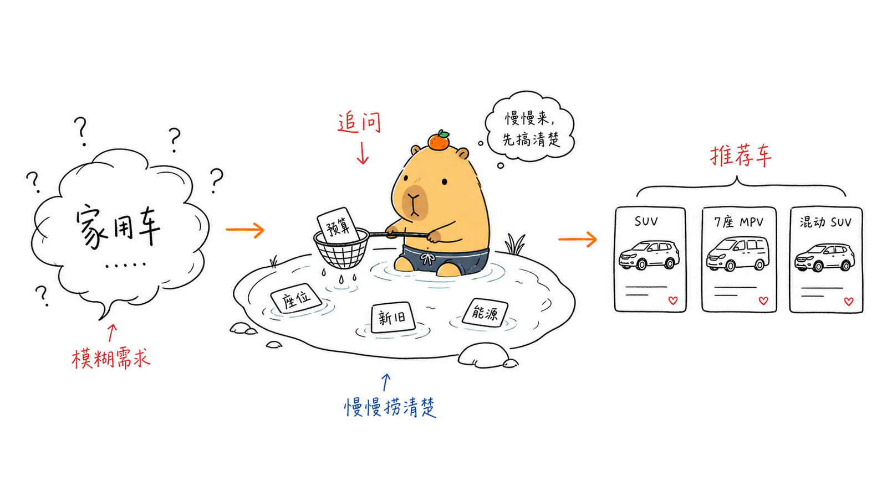
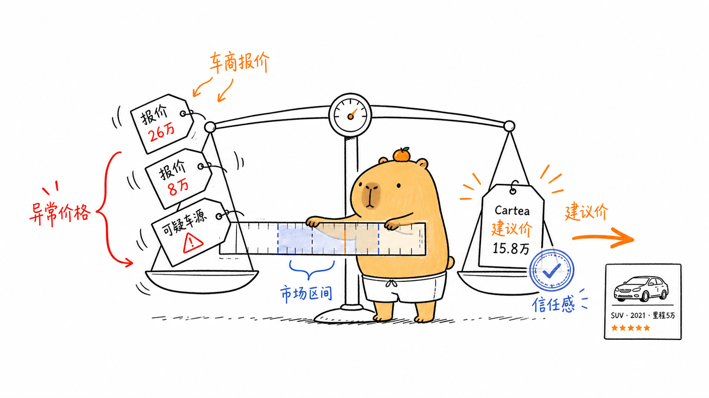
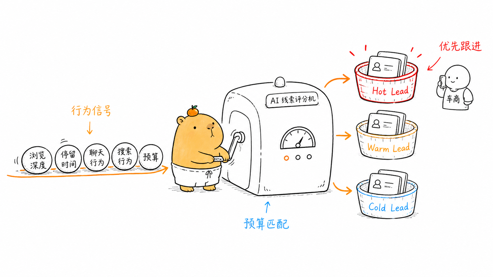
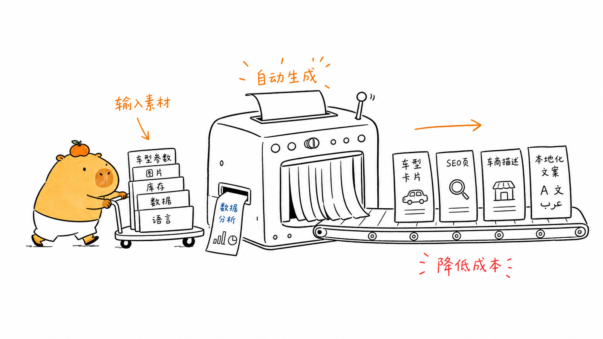
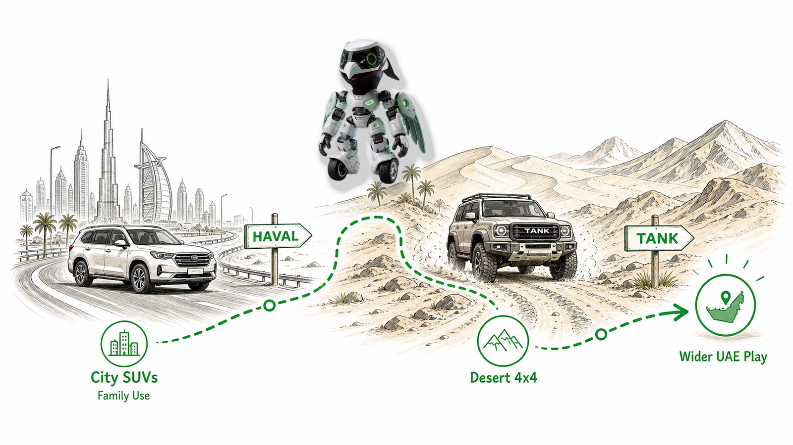
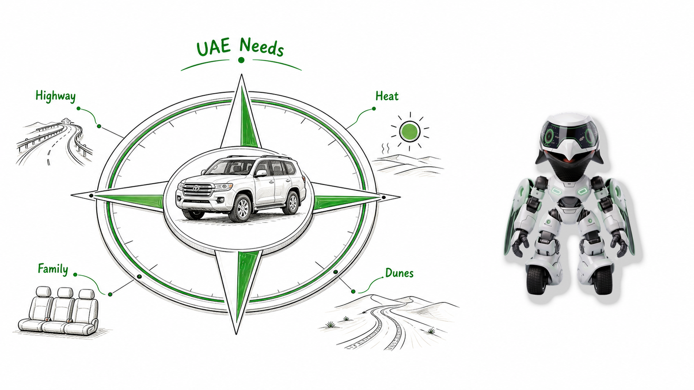
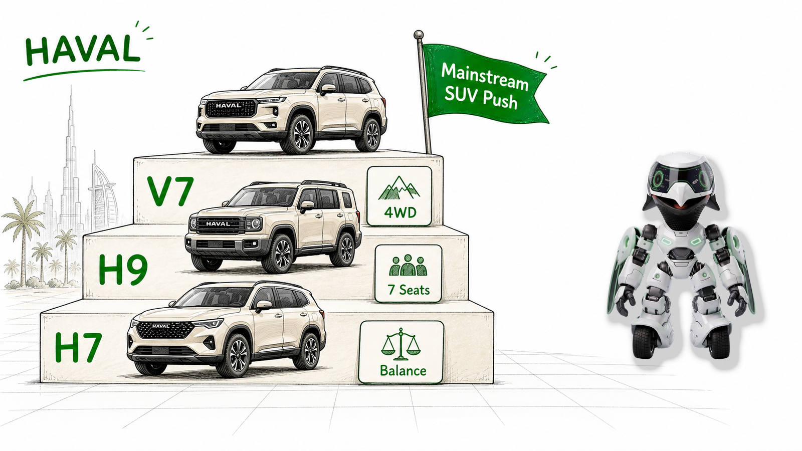
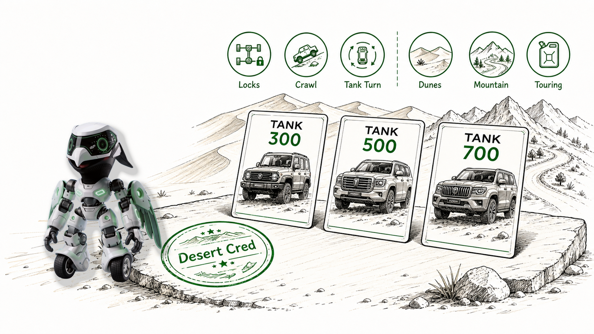
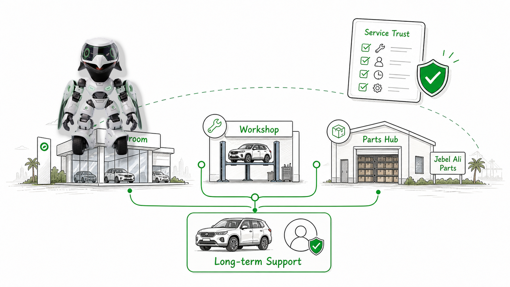
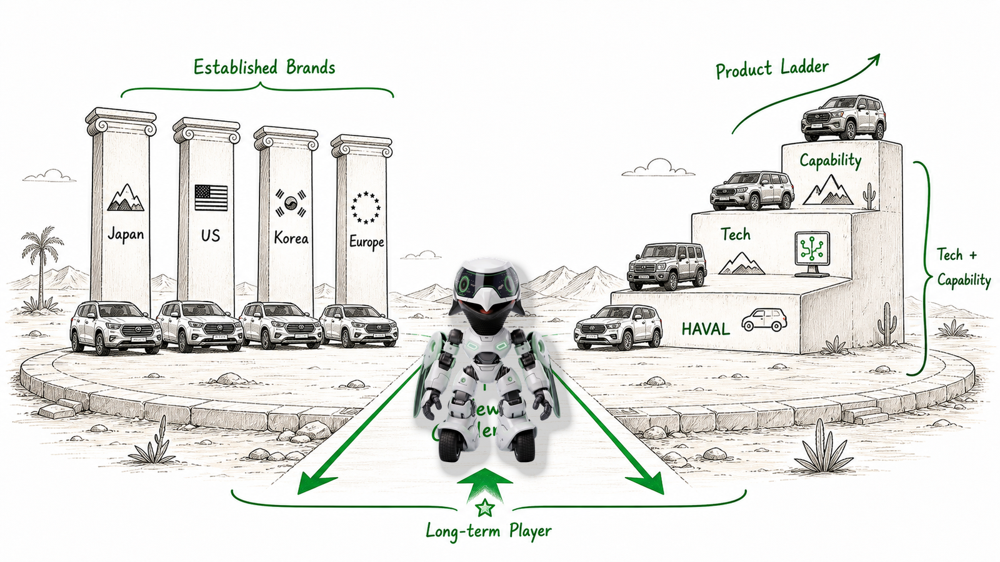

# Lulu Article Illustrations

> 把中文文章里的判断、流程、结构和状态，变成一张张白底、手绘、温吞但清爽的噜噜正文配图。
>
> 16:9 横版 | 噜噜 IP | 纯白手绘 | 少量红橙蓝中文批注 | Codex Skill

---

## 这个仓库是什么

Lulu Article Illustrations 是一个 Codex Skill，用来指导 AI Agent 为中文文章、帖子、博客、Notion 文档和方法论内容生成正文配图。

它不是通用插画 prompt，也不是 PPT 信息图模板。它的目标是：先理解文章里的认知锚点，再把其中一个判断、流程、结构、状态或隐喻，变成一张有记忆点的 16:9 手绘解释图。

默认视觉 IP 是“噜噜”：暖黄橙色、圆钝水豚气质、头顶橘子或橙色识别点、豆豆眼、短裤、情绪稳定、慢吞吞但认真承接问题。噜噜必须参与画面的核心动作，不能只是站在旁边当装饰。

这个 skill 的结构、工作流和文档组织方式参考了 Ian 的 [ian-xiaohei-illustrations](https://github.com/helloianneo/ian-xiaohei-illustrations) 小黑正文配图 skill，并在角色气质、构图隐喻和 QA 规则上改造成噜噜风格。

---

## 适合谁用

特别适合：

- 写中文文章，需要正文配图和文章插图的人
- 做 AI、产品、运营、方法论、复盘类内容的人
- 想把抽象判断画成具体隐喻的人
- 想要一种比 PPT 信息图更轻、更温吞、更有个人识别度的配图风格的人
- 用 Codex 做内容生产，希望稳定复用一套视觉语言的人

不适合：

- 想要商业插画、品牌 KV 或精致扁平插画的人
- 想要传统 PPT 信息图、复杂架构图或正式流程图的人
- 想要表情包、头像、贴纸合集的人
- 想把大量正文、长段解释或完整课程页塞进一张图里的人
- 需要严格可编辑矢量源文件的人

---

## 示例效果

下面这组图来自文章《AI 如何改变汽车平台的用户决策与交易路径》，用于演示 skill 的正文配图方向。

### AI 导购入口变化


### AI 需求澄清



### AI 价格智能



### AI 线索评分



### AI 运营自动化



这些图片是效果样例，不是固定构图模板。使用时应该从当前文章重新发明隐喻，不要照抄旧案例的物件和构图。

---

## Cartea 猎隼机器人 Skill

仓库里也包含一个单独拆分出来的 Cartea 汽车文章配图 skill：

```text
cartea-falcon-ip/
```

它用于生成 Cartea 猎隼机器人 IP 风格的汽车文章、车型新闻、UAE/GCC 市场分析和品牌策略配图。Cartea 品牌色固定为绿色 `#00a600`；猎隼机器人形象严格参考 `cartea-falcon-ip/assets/reference/` 下的正面、背面和侧面参考图。

完整使用说明见：[docs/cartea-falcon-ip.md](docs/cartea-falcon-ip.md)。

常用调用方式：

```text
Use $cartea-falcon-ip 根据这篇文章生成 6 张配图，尺寸 1600x900。
```

```text
Use $cartea-falcon-ip 为这篇文章生成小红书封面，尺寸 1080x1440。
```

```text
Use $cartea-falcon-ip 生成网站 banner，尺寸 2400x1000，分辨率 2K。
```

新 skill 还包含尺寸归一化脚本：

```text
cartea-falcon-ip/scripts/normalize_image_size.py
```

如果图像模型输出尺寸不精确，脚本会把最终 PNG 处理到指定宽高。

### ROX + KEZAD AI 制造文章案例

下面这组图基于 Cartea 文章 [ROX and KEZAD Put Abu Dhabi on the Map for AI-Driven Car Manufacturing](https://www.icartea.com/en/news/rox-and-kezad-put-abu-dhabi-on-the-map-for-ai-driven-car-manufacturing) 生成，全部是默认尺寸 `1600x900`。

案例说明见：[docs/cartea-falcon-ip.md#案例rox-与-kezad-ai-汽车制造文章](docs/cartea-falcon-ip.md#案例rox-与-kezad-ai-汽车制造文章)。

配图规划见：[examples/rox-kezad-ai-manufacturing-falcon/shot-list.md](examples/rox-kezad-ai-manufacturing-falcon/shot-list.md)。


### GWM UAE 文章案例

下面这组图基于 Cartea 文章 [From City SUVs to Desert Machines: GWM Expands Its UAE Ambition](https://www.icartea.com/en/news/from-city-suvs-to-desert-machines-gwm-expands-its-uae-ambition) 生成，全部是 `1600x900`。













配图规划见 [examples/gwm-uae-falcon/shot-list.md](examples/gwm-uae-falcon/shot-list.md)。

---

## 安装

### 方式一：复制 skill 目录

克隆仓库：

```bash
git clone https://github.com/Lupumbba/lulu-article-illustrations.git
cd lulu-article-illustrations
```

复制 skill 到 Codex skills 目录：

```bash
mkdir -p "${CODEX_HOME:-$HOME/.codex}/skills"
cp -R ./lulu-article-illustrations "${CODEX_HOME:-$HOME/.codex}/skills/"
cp -R ./cartea-falcon-ip "${CODEX_HOME:-$HOME/.codex}/skills/"
```

安装后，在 Codex 里这样调用：

```text
Use $lulu-article-illustrations 为这篇中文文章设计并生成几张噜噜风格正文配图。
```

### 方式二：使用打包文件

仓库里也提供了打包文件：

```text
dist/lulu-article-illustrations.skill
dist/cartea-falcon-ip.skill
```

如果你的 Codex 环境支持导入 `.skill` 文件，可以直接导入这个包。

---

## 怎么用

### 只做配图规划

```text
Use $lulu-article-illustrations 先不要生图。
请分析下面这篇文章哪里值得配图，输出 5 张左右的 shot list。
每张图写清楚：放在哪段后、主题、核心意思、结构类型、噜噜在做什么、建议中文标注词。

<粘贴文章>
```

### 直接生成正文配图

```text
Use $lulu-article-illustrations 把下面这篇文章生成 4 张噜噜风格正文配图。
要求：16:9 横版、纯白背景、黑色手绘线稿、暖黄橙噜噜、少量红橙蓝中文手写批注。

<粘贴文章>
```

### 为单个概念生成一张图

```text
Use $lulu-article-illustrations 为“AI 把模糊需求慢慢澄清成可推荐条件”生成一张正文配图。
画面要温吞但清爽，噜噜必须承担核心动作。
```

### 去掉图里的标题或错误文字

```text
Use $lulu-article-illustrations 帮我编辑这张图，去掉左上角的“流程图”标题，其他内容保持不变。
```

更多 prompt 示例见 [examples/prompts.md](examples/prompts.md)。

---

## 工作流程

这个 skill 的流程是：

1. 读取文章、Markdown、Notion 内容、截图或用户给的主题。
2. 提炼核心观点、认知转折、流程结构和适合视觉化的段落。
3. 先输出 shot list：每张图只选一个认知锚点。
4. 为每张图选择结构类型：缓冲带、承接托盘、前后对比、系统局部、沉淀池、方法分层、地图路线或小漫画分镜。
5. 重新发明一个低科技、温吞但成立的物理隐喻。
6. 让噜噜承担核心动作。
7. 每张图单独调用图像模型生成。
8. 按 QA checklist 检查：白底、留白、噜噜动作、中文标注、非 PPT 感、非表情包感。
9. 保存最终 PNG，并报告用途和路径。

---

## 目录结构

```text
.
├── README.md
├── LICENSE
├── NOTICE.md
├── docs/
│   └── cartea-falcon-ip.md
├── dist/
│   ├── lulu-article-illustrations.skill
│   └── cartea-falcon-ip.skill
├── examples/
│   ├── prompts.md
│   ├── 01-ai-agent-entry-shift.png
│   ├── 02-ai-need-clarification.png
│   ├── 03-ai-price-intelligence.png
│   ├── 04-ai-lead-scoring.png
│   ├── 05-ai-operations-engine.png
│   ├── gwm-uae-falcon/
│   └── rox-kezad-ai-manufacturing-falcon/
├── lulu-article-illustrations/
│   ├── SKILL.md
│   ├── agents/
│   │   └── openai.yaml
│   └── references/
│       ├── style-dna.md
│       ├── lulu-ip.md
│       ├── shot-list-rules.md
│       ├── composition-patterns.md
│       ├── prompt-template.md
│       └── qa-checklist.md
├── cartea-falcon-ip/
│   ├── SKILL.md
│   ├── agents/
│   │   └── openai.yaml
│   ├── assets/
│   │   └── reference/
│   ├── references/
│   │   ├── falcon-ip.md
│   │   ├── size-resolution.md
│   │   ├── article-shot-list.md
│   │   ├── prompt-template.md
│   │   └── qa-checklist.md
│   └── scripts/
│       └── normalize_image_size.py
```

真正需要安装到 Codex 的是子目录：

```text
lulu-article-illustrations/
cartea-falcon-ip/
```

---

## 和 Ian 小黑 skill 的关系

这个项目明确参考了 Ian 的 [ian-xiaohei-illustrations](https://github.com/helloianneo/ian-xiaohei-illustrations)：

- 参考了它把“正文配图”做成 Codex Skill 的整体思路。
- 参考了 `SKILL.md + references + agents/openai.yaml + examples` 的组织方式。
- 参考了“先读文章、提炼认知锚点、输出 shot list、再单张生成、最后 QA”的工作流。
- 没有复用原仓库的小黑角色设定、示例图片或视觉资产。
- 已在 [NOTICE.md](NOTICE.md) 中保留 attribution。

---

## 重新打包 skill

如果你修改了 skill 内容，可以用 Codex skill-creator 的打包脚本重新生成 `.skill` 文件：

```bash
python3 /path/to/skill-creator/scripts/package_skill.py lulu-article-illustrations dist
python3 /path/to/skill-creator/scripts/package_skill.py cartea-falcon-ip dist
```

打包前建议先运行校验：

```bash
python3 /path/to/skill-creator/scripts/quick_validate.py lulu-article-illustrations
python3 /path/to/skill-creator/scripts/quick_validate.py cartea-falcon-ip
```

---

## License

MIT. See [LICENSE](LICENSE).
