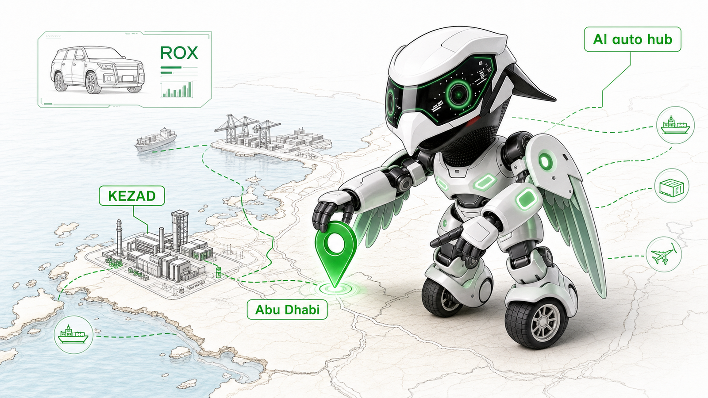
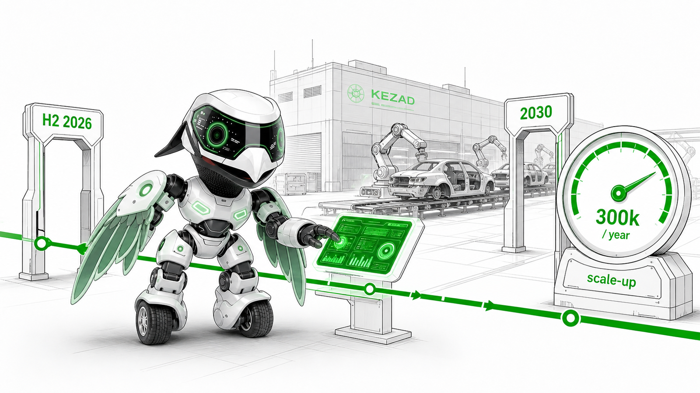
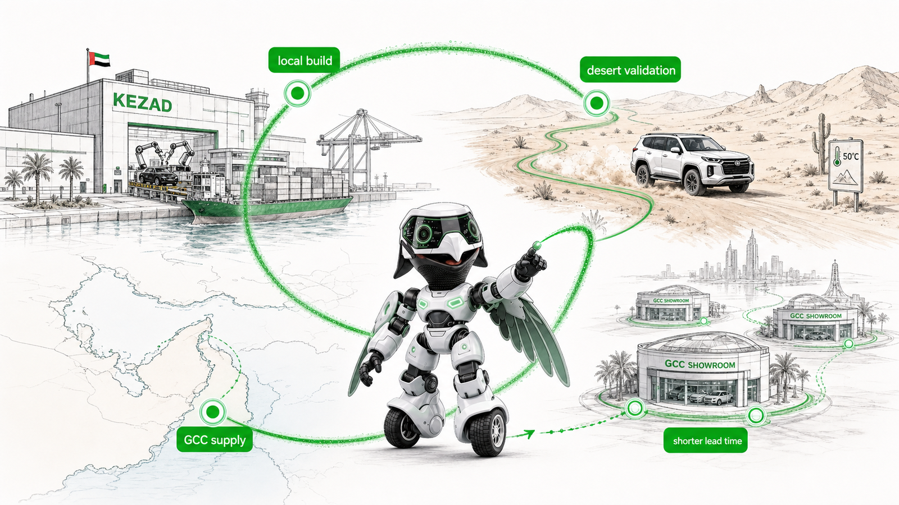
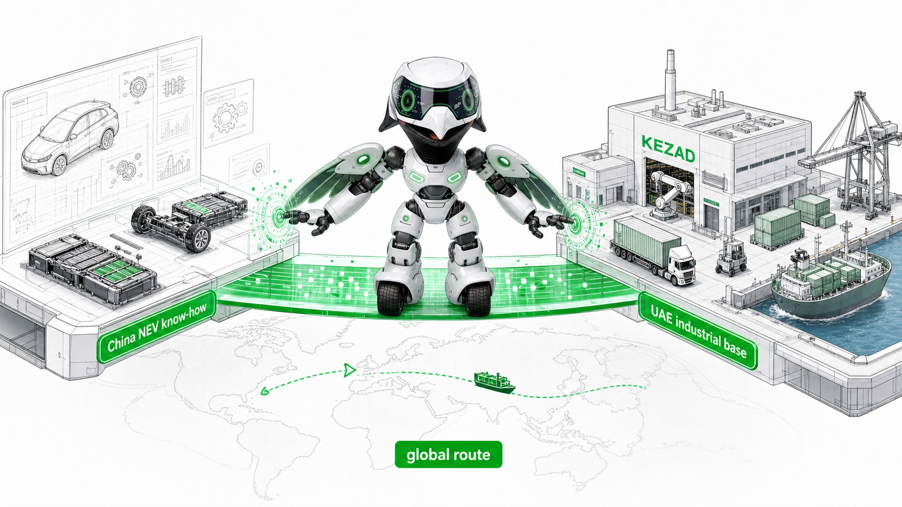
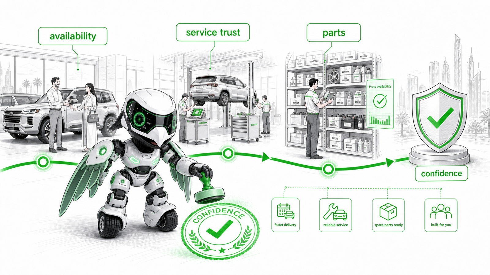

# Cartea Falcon IP Skill

`cartea-falcon-ip/` 是一个独立的 Codex Skill 文件夹，用来为 Cartea 汽车文章、车型新闻、UAE/GCC 市场分析、品牌策略和销售内容生成猎隼机器人 IP 风格配图。

这个 skill 的组织方式参考了 Ian 的 [ian-xiaohei-illustrations](https://github.com/helloianneo/ian-xiaohei-illustrations)：用 `SKILL.md + references + agents/openai.yaml + examples` 管理触发说明、分镜方法、角色规则、提示词模板和案例。但 Cartea skill 使用的是独立的猎隼机器人 IP、Cartea 绿色品牌色和汽车内容工作流，没有复用小黑角色或视觉资产。

## 文件夹结构

```text
cartea-falcon-ip/
├── SKILL.md
├── agents/
│   └── openai.yaml
├── assets/
│   └── reference/
│       ├── front.png
│       ├── back.png
│       ├── side.png
│       └── side-alt.png
├── references/
│   ├── article-shot-list.md
│   ├── falcon-ip.md
│   ├── prompt-template.md
│   ├── qa-checklist.md
│   └── size-resolution.md
└── scripts/
    └── normalize_image_size.py
```

真正安装到 Codex 的是整个 `cartea-falcon-ip/` 文件夹。`docs/` 和 `examples/` 是给 GitHub 读者看的说明和案例，不属于 skill 本体。

## 安装

把仓库克隆到本地：

```bash
git clone https://github.com/Lupumbba/lulu-article-illustrations.git
cd lulu-article-illustrations
```

复制 Cartea skill 到 Codex skills 目录：

```bash
mkdir -p "${CODEX_HOME:-$HOME/.codex}/skills"
cp -R ./cartea-falcon-ip "${CODEX_HOME:-$HOME/.codex}/skills/"
```

如果你的 Codex 环境支持导入 `.skill` 文件，也可以导入：

```text
dist/cartea-falcon-ip.skill
```

## 如何调用

默认正文配图尺寸是 `1600x900`。如果你不指定尺寸，skill 会按这个规格处理。

直接为文章生成 6 张配图：

```text
Use $cartea-falcon-ip
请为下面这篇汽车文章生成 6 张正文配图，尺寸和像素使用默认值。

<粘贴文章链接或正文>
```

只做分镜规划，不生图：

```text
Use $cartea-falcon-ip
先不要生图。请分析下面这篇文章，输出 4-6 张 shot list。
每张图写清楚：放在哪段后、主题、核心意思、猎隼动作、画面元素、建议标注词。

<粘贴文章链接或正文>
```

指定社媒尺寸：

```text
Use $cartea-falcon-ip
请把这篇文章生成小红书封面，尺寸 1080x1440。

<粘贴文章链接或正文>
```

指定网站 banner：

```text
Use $cartea-falcon-ip
请为这篇文章生成网站 banner，尺寸 2400x1000。

<粘贴文章链接或正文>
```

## 必须遵守的视觉规则

- Cartea 品牌色固定为 `#00a600`。
- Cartea 的路线、按钮、标注、发光组件和信任信号都优先用 `#00a600`。
- 猎隼机器人必须参考 `cartea-falcon-ip/assets/reference/` 的四张图片。
- 机器人必须保留白色机械外壳、黑色玻璃面罩、绿色 UI 圆环、白色鸟喙、黑色纹理脖颈、翼状机械手、黑色手指和轮式双脚。
- 机器人需要参与画面核心动作，不能只是角落装饰。
- 生成时应让机器人和场景一起画出来，不要做后期贴图式拼接。
- 不要把 Cartea 主色做成橙色。
- 不要把猎隼改成自然鸟、鹰、猫头鹰、凤凰、毛绒吉祥物或其他机器人。

## 工作流

1. 读取文章链接、正文、Markdown 或截图。
2. 提炼文章主判断、车型/市场分层、用户价值、区域需求和信任证据。
3. 输出或内部规划 4-6 张 shot list。
4. 每张图只表达一个结构点，避免把整篇文章塞进一张图。
5. 让 Cartea 猎隼机器人承担核心动作，例如扫描、指路、校准、盖章、连接供应链。
6. 使用白底或浅沙色编辑插画风格，保留大量留白。
7. 生成后运行尺寸检查；需要时用 `scripts/normalize_image_size.py` 归一化宽高。
8. 按 `references/qa-checklist.md` 检查角色、颜色、可读性和文章对应关系。

## 案例：ROX 与 KEZAD AI 汽车制造文章

案例来源：[ROX and KEZAD Put Abu Dhabi on the Map for AI-Driven Car Manufacturing](https://www.icartea.com/en/news/rox-and-kezad-put-abu-dhabi-on-the-map-for-ai-driven-car-manufacturing)

案例目录：[examples/rox-kezad-ai-manufacturing-falcon](../examples/rox-kezad-ai-manufacturing-falcon)

分镜说明：[shot-list.md](../examples/rox-kezad-ai-manufacturing-falcon/shot-list.md)

这篇文章的核心不是单纯宣传建厂，而是解释 ROX 与 KEZAD 如何把阿布扎比放到 AI 驱动汽车制造地图上。因此案例拆成 6 张正文配图：

1. Abu Dhabi AI Auto Hub：说明阿布扎比和 KEZAD 成为制造节点。
2. 2026-2030 Factory Timeline：说明 H2 2026 到 2030 年 30 万辆年产能目标。
3. AI-Driven Assembly Line：说明 AI 检测、智能产线和质量闭环。
4. GCC Localisation Loop：说明本地制造、GCC 供应、沙漠验证和交付周期。
5. China-UAE Industrial Bridge：说明中国 NEV 能力与 UAE 工业平台的连接。
6. Buyer Value：说明本地制造对买家的供给、售后、配件和信任价值。

### 1. Abu Dhabi AI Auto Hub



### 2. 2026-2030 Factory Timeline



### 3. AI-Driven Assembly Line


### 4. GCC Localisation Loop



### 5. China-UAE Industrial Bridge



### 6. Buyer Value From Local Manufacturing



## 尺寸检查

案例中的 6 张图片都已归一化为默认正文尺寸：

```text
1600x900
```

如果新生成图片不是目标尺寸，可以运行：

```bash
python3 cartea-falcon-ip/scripts/normalize_image_size.py \
  --input <source.png> \
  --output <target.png> \
  --width 1600 \
  --height 900 \
  --fit cover
```

对于文字密集或边缘有重要标签的图片，可以把 `--fit cover` 改成 `--fit contain`，避免裁掉关键信息。
